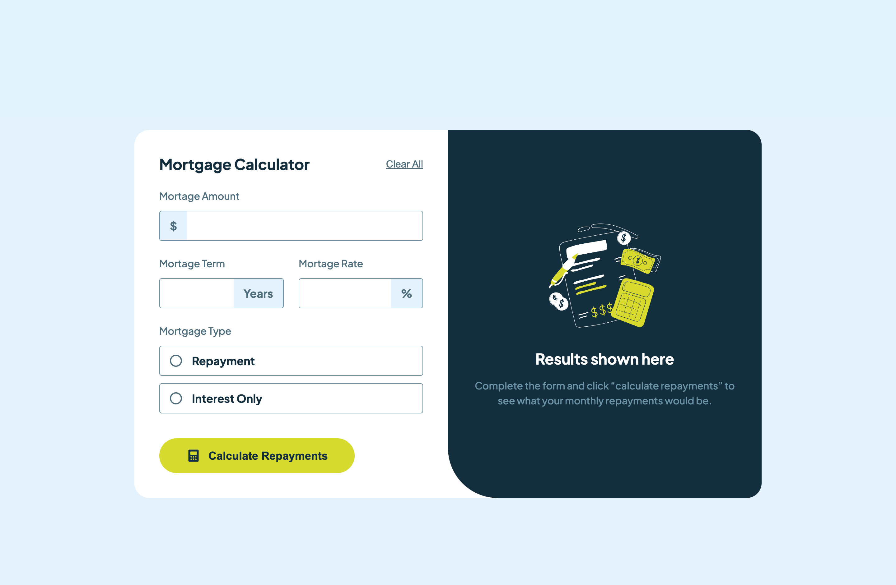

# Frontend Mentor - Mortgage repayment calculator solution

This is a solution to the [Mortgage repayment calculator challenge on Frontend Mentor](https://www.frontendmentor.io/challenges/mortgage-repayment-calculator-Galx1LXK73). Frontend Mentor challenges help you improve your coding skills by building realistic projects.

## Table of contents

- [Overview](#overview)
  - [The challenge](#the-challenge)
  - [Screenshot](#screenshot)
  - [Links](#links)
- [My process](#my-process)
  - [Built with](#built-with)
  - [What I learned](#what-i-learned)
  - [Continued development](#continued-development)
  - [Useful resources](#useful-resources)
- [Author](#author)
- [Acknowledgments](#acknowledgments)

## Overview

### The challenge

Users should be able to:

- Input mortgage information and see monthly repayment and total repayment amounts after submitting the form
- See form validation messages if any field is incomplete
- Complete the form only using their keyboard
- View the optimal layout for the interface depending on their device's screen size
- See hover and focus states for all interactive elements on the page

### Screenshot



### Links

- Solution URL: [Github](https://github.com/delroscol98/mortgage-calculator)
- Live Site URL: [Add live site URL here](https://your-live-site-url.com)

## My process

### Built with

- Semantic HTML5 markup
- CSS custom properties
- Flexbox
- CSS Grid
- Mobile-first workflow
- [React](https://reactjs.org/) - JS library

### What I learned

I chose this project to practice using the useRef hook.

```js
const clearButtonHandler = (e) => {
  e.preventDefault();

  setFormData({
    amount: "",
    term: "",
    rate: "",
    type: "",
  });

  repaymentRef.current.checked = false;
  interestRef.current.checked = false;
  amountRef.current.setAttribute("focused", "false");
  termRef.current.setAttribute("focused", "false");
  rateRef.current.setAttribute("focused", "false");

  setIsValid(false);
};
```

### Continued development

I would like to scale up this calculator to make it specific to the Australian market and therefore include more variables such as:

- First home vs nth home;
- Stamp duty?
- Lender's Mortgage Insurance?
- Deposit amount?

### Useful resources

- [Youtube - Bro Code](https://www.youtube.com/watch?v=AltU-XcGvuo) - This video helped me to better understand the useRef hook
- [Youtube - Physics Ninja](https://www.youtube.com/watch?v=iilFXMHKkZQ) - This video helped to understand the calculations

## Author

- Frontend Mentor - [@delroscol98](https://www.frontendmentor.io/profile/delroscol98)
